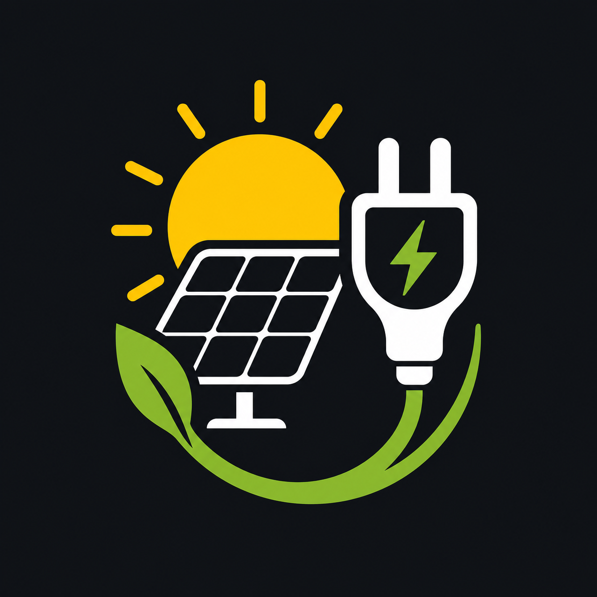

# Solar EV Charger Controller

<p align="center">
  
</p>

Custom integration for Home Assistant that controls EV charging with solar surplus, cheap electricity windows, and basic home battery protection.

The first target setup is a Tesla Model Y with a Tesla wall charger, solar production, and a Huawei home battery, but the integration is intentionally generic. It controls existing Home Assistant entities instead of depending on one car, charger, inverter, or vendor integration.

## What it does

Solar EV Charger Controller reads your grid power sensor as the main source of truth. If the house is exporting power, it calculates available surplus and recommends a charging current:

```text
recommended_amps = floor((surplus_w - safety_margin_w) / voltage)
```

It then applies minimum and maximum amps, schedules, mode rules, SOC limits, cooldowns, and hysteresis before sending start, stop, or amps commands to your configured Home Assistant entities.

## Current status

This is an early functional version. It supports:

- UI config flow.
- HACS custom repository layout.
- Grid power polarity selection.
- Start and stop through `button` or `switch` entities.
- Charge current through a `number` entity.
- Solar surplus calculation.
- Recommended amps calculation.
- Off, Solar only, Cheap hours, Hybrid, Force charge, and Manual modes.
- Cheap-hours window with midnight crossing support.
- Solar window.
- `need car tomorrow` switch.
- Home battery SOC and discharge protection.
- Start/stop cooldown and surplus hysteresis.
- Diagnostic sensors and binary sensors.

It does not yet implement predictive planning, solar forecast logic, dynamic tariff optimization, multi-car support, or advanced Tesla/Huawei-specific behavior.

## Installation

### Manual

Copy this directory into Home Assistant:

```bash
custom_components/solar_ev_charger
```

For example:

```bash
cp -r custom_components/solar_ev_charger /config/custom_components/
```

Restart Home Assistant, then go to:

```text
Settings -> Devices & services -> Add integration -> Solar EV Charger Controller
```

### HACS custom repository

1. Open HACS.
2. Go to `Integrations`.
3. Open the three-dot menu.
4. Choose `Custom repositories`.
5. Add your GitHub repository URL.
6. Select category `Integration`.
7. Install `Solar EV Charger Controller`.
8. Restart Home Assistant.

## Creating the local repository

If the GitHub repo does not exist yet:

```bash
cd ~/Documents/AI
mkdir -p ha-solar-ev-charger
cd ha-solar-ev-charger
git init
```

If it already exists:

```bash
cd ~/Documents/AI
git clone <repo> ha-solar-ev-charger
cd ha-solar-ev-charger
```

## Initial configuration

Required entities:

- Grid power sensor, for example `sensor.grid_power`.
- Start charge entity, for example `button.tesla_start_charge` or `switch.ev_charger`.
- Stop charge entity, for example `button.tesla_stop_charge` or `switch.ev_charger`.
- Charge amps number entity, for example `number.tesla_charging_amps`.

Optional entities:

- Solar power sensor.
- House consumption sensor.
- Home battery power sensor.
- Home battery SOC sensor.
- Car SOC sensor.
- General charger enable switch.
- Energy price sensor.
- Solar forecast entity.

The grid power sensor is the primary signal. By default, the integration assumes:

```text
positive = importing from grid
negative = exporting to grid
```

If your sensor uses the opposite convention, enable `Grid power positive means export` during setup.

## Modes

`Off`: The controller does nothing. If charging was started by this integration, it may stop it.

`Solar only`: Charges only when stable solar surplus exists inside the solar window.

`Cheap hours`: Charges only inside the configured cheap-hours window. It can charge from the grid.

`Hybrid`: Uses solar surplus during the solar window. During cheap hours it can charge if `Need car tomorrow` or `Allow grid import` is enabled.

`Force charge`: Starts charging immediately at max amps, while still respecting target car SOC and basic safety checks.

`Manual`: The integration publishes diagnostics but sends no start, stop, or amps commands.

## Default options

```text
min_amps = 6
max_amps = 16
safety_margin_w = 300
min_surplus_w = 1400
target_car_soc = 80
home_battery_min_soc = 80
max_grid_import_w = 0
voltage = 230
cheap_hours_start = 00:00
cheap_hours_end = 08:00
cheap_hours_all_weekend = false
solar_window_start = 09:00
solar_window_end = 18:00
ready_by_time = 07:30
surplus_on_duration = 180 seconds
surplus_off_duration = 180 seconds
minimum_action_interval = 120 seconds
update_interval = 30 seconds
```

Cheap-hours and solar windows support ranges that cross midnight, such as:

```text
23:00 -> 07:00
```

If your tariff has cheap electricity all weekend, enable:

```text
switch.solar_ev_charger_cheap_hours_all_weekend
```

When enabled, Saturday and Sunday are treated as cheap hours for the full day.

## Entities created

Switches:

```text
switch.solar_ev_charger_enabled
switch.solar_ev_charger_need_car_tomorrow
switch.solar_ev_charger_allow_grid_import
switch.solar_ev_charger_allow_home_battery
switch.solar_ev_charger_cheap_hours_all_weekend
```

Select:

```text
select.solar_ev_charger_mode
```

Numbers:

```text
number.solar_ev_charger_min_amps
number.solar_ev_charger_max_amps
number.solar_ev_charger_safety_margin_w
number.solar_ev_charger_min_surplus_w
number.solar_ev_charger_target_car_soc
number.solar_ev_charger_home_battery_min_soc
number.solar_ev_charger_max_grid_import_w
number.solar_ev_charger_voltage
```

Sensors:

```text
sensor.solar_ev_charger_available_surplus_w
sensor.solar_ev_charger_grid_power_w
sensor.solar_ev_charger_grid_import_w
sensor.solar_ev_charger_recommended_amps
sensor.solar_ev_charger_current_state
sensor.solar_ev_charger_last_action
sensor.solar_ev_charger_reason
sensor.solar_ev_charger_estimated_power_w
```

Binary sensors:

```text
binary_sensor.solar_ev_charger_has_surplus
binary_sensor.solar_ev_charger_in_cheap_hours
binary_sensor.solar_ev_charger_in_solar_window
binary_sensor.solar_ev_charger_home_battery_protected
binary_sensor.solar_ev_charger_should_charge
```

Buttons:

```text
button.solar_ev_charger_start_now
button.solar_ev_charger_stop_now
button.solar_ev_charger_recalculate
```

## Tesla example

Example entity mapping:

```text
Grid power sensor: sensor.grid_power
Start charge entity: button.tesla_start_charge
Stop charge entity: button.tesla_stop_charge
Charge amps entity: number.tesla_charging_amps
Car SOC sensor: sensor.tesla_battery_level
Home battery SOC sensor: sensor.huawei_battery_soc
Home battery power sensor: sensor.huawei_battery_power
```

Recommended starting options:

```text
mode = Hybrid
min_amps = 6
max_amps = 16
safety_margin_w = 300
min_surplus_w = 1400
target_car_soc = 80
home_battery_min_soc = 80
allow_home_battery = false
cheap_hours_start = 00:00
cheap_hours_end = 08:00
solar_window_start = 09:00
solar_window_end = 18:00
```

## Generic charger example

If your charger is exposed as a switch:

```text
Start charge entity: switch.ev_charger
Stop charge entity: switch.ev_charger
Charge amps entity: number.ev_charger_current
```

The integration will call:

```yaml
service: switch.turn_on
target:
  entity_id: switch.ev_charger
```

and:

```yaml
service: switch.turn_off
target:
  entity_id: switch.ev_charger
```

## Lovelace dashboard example

```yaml
type: entities
title: Solar EV Charger
entities:
  - entity: select.solar_ev_charger_mode
  - entity: switch.solar_ev_charger_enabled
  - entity: switch.solar_ev_charger_need_car_tomorrow
  - entity: switch.solar_ev_charger_allow_grid_import
  - entity: switch.solar_ev_charger_allow_home_battery
  - entity: number.solar_ev_charger_target_car_soc
  - entity: number.solar_ev_charger_max_amps
  - entity: sensor.solar_ev_charger_available_surplus_w
  - entity: sensor.solar_ev_charger_recommended_amps
  - entity: sensor.solar_ev_charger_current_state
  - entity: sensor.solar_ev_charger_last_action
  - entity: sensor.solar_ev_charger_reason
  - entity: button.solar_ev_charger_start_now
  - entity: button.solar_ev_charger_stop_now
```

## Services

Available services:

```text
solar_ev_charger.start
solar_ev_charger.stop
solar_ev_charger.recalculate
solar_ev_charger.set_mode
```

Example:

```yaml
service: solar_ev_charger.set_mode
data:
  mode: "Solar only"
```

If you have multiple controller instances, include `config_entry_id`.

## Home battery protection

If `Allow home battery` is off, the controller pauses charging when:

- Home battery SOC is below the configured minimum.
- Home battery power indicates discharge.

During setup, choose the battery power polarity. The default is:

```text
positive = discharging
negative = charging
```

Enable the inverted option if your sensor uses:

```text
positive = charging
negative = discharging
```

`Force charge` can bypass home battery protection, but it still respects target car SOC.

## Internal states

The current state sensor can show:

```text
off
idle
waiting_for_surplus
charging_solar
charging_cheap
charging_forced
paused_no_surplus
paused_home_battery_protection
paused_outside_schedule
manual
error
```

## Safety disclaimer

This integration is software automation only. It is not a certified electrical protection device and does not replace physical safety systems such as breakers, RCDs, certified dynamic load management, grid-code-compliant export control, correct wiring, or work performed by a qualified electrician.

Use conservative limits. Test with supervision. You are responsible for ensuring that your charger, vehicle, inverter, home battery, and electrical installation remain within safe and legal operating limits.

## Roadmap

- Solar forecast support.
- Dynamic electricity price support.
- Automatic planning to reach target SOC by a given time.
- Multi-car support.
- Multi-charger support.
- Power-based control instead of amps-only control.
- Calendar integration.
- Spanish 2.0TD tariff helpers.
- Common Huawei/FusionSolar sensor presets.
- Advanced Tesla behavior.
